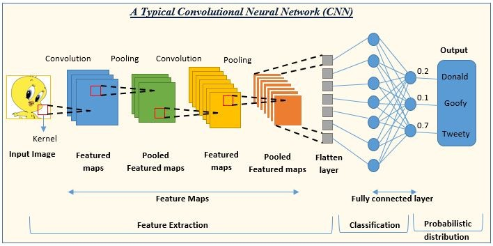
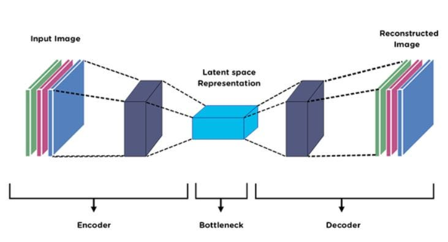
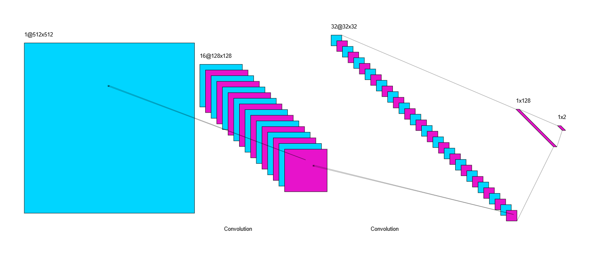
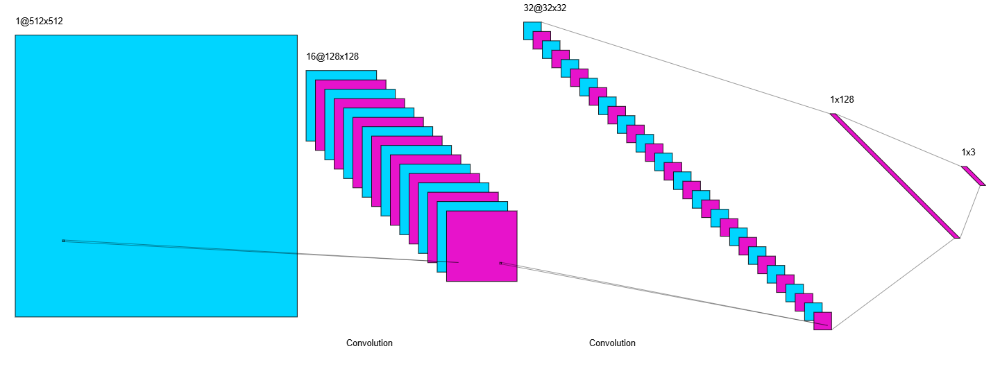
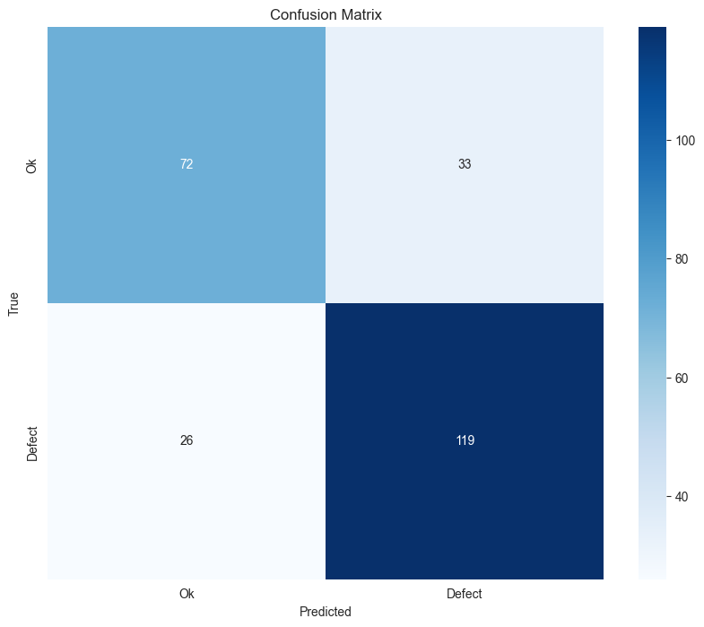
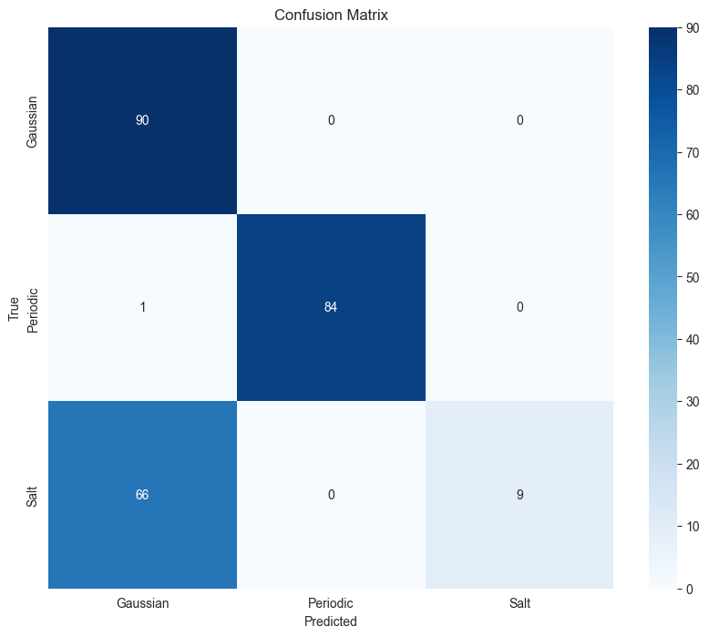
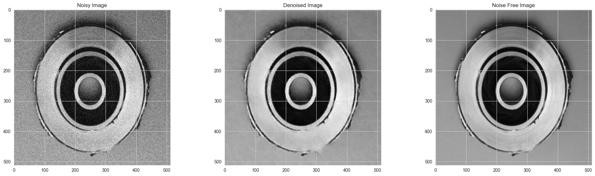
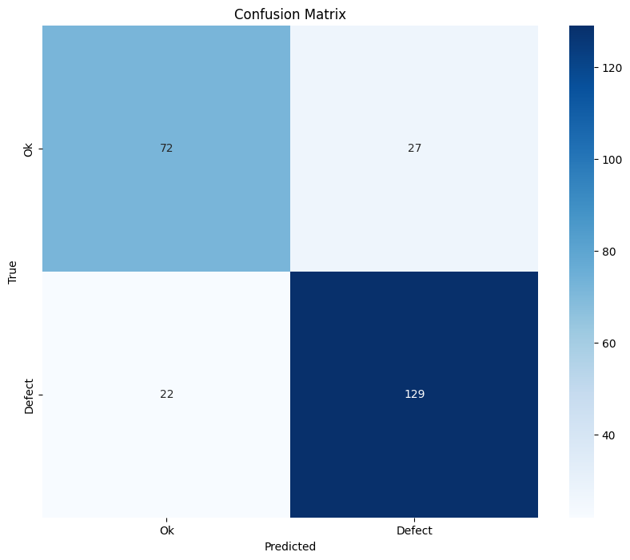

Contents

[1. Introduction](#introduction)

[2. Methodology](#methodology)

[2.1. Dataset](#dataset)

[2.2. Data Loading](#data-loading)

[2.3. Preprocessing](#preprocessing)

[2.4. Convolutional Neural Networks](#convolutional-neural-networks)

[2.5. Encoder Decoder Model](#encoder-decoder-model)

[2.6. Defect/Ok Classification Model](#defectok-classification-model)

[2.7. Noise Classification Model](#noise-classification-model)

[2.8. Encoder-Decoder Model](#encoder-decoder-model-1)

[2.9. Evaluation Metrics](#evaluation-metrics)

[3. Results](#results)

[3.1. Defect/Ok Classification With Noise Results](#defectok-classification-with-noise-results)

[3.1.1. Evaluation Metrics](#evaluation-metrics-1)

[3.1.2. Confusion Matrix](#confusion-matrix)

[3.2. Noise Classification Results](#noise-classification-results)

[3.2.1. Evaluation Metrics](#evaluation-metrics-2)

[3.2.2. Confusion Matrix](#confusion-matrix-1)

[3.3. Denoise Using Encoder Decoder Results](#denoise-using-encoder-decoder-results)

[3.3.1. Evaluation Metrics](#evaluation-metrics-3)

[3.3.2. Sample Denoise Result](#sample-denoise-result)

[3.4. Def/Ok Denoised Images Classify Results](#defok-denoised-images-classify-results)

[3.4.1. Evaluation Metrics](#evaluation-metrics-4)

[3.4.2. Confusion Matrix](#confusion-matrix-2)

[4. Conclusion](#conclusion)

[5. References](#references)

# Introduction

In this project, we aimed to classify images of "defect" and "ok" disks, and subsequently enhance their quality through a denoising process. Initially, we focused on categorizing the images based on their condition, identifying whether they were flawed or acceptable. To further improve the quality and accuracy of our classifications, we applied a deep learning-based denoising technique utilizing an encoder-decoder model. Following the denoising process, we reclassified the images to evaluate any changes in accuracy. This report outlines the methodology, results, and analysis of our approach in refining image classification through advanced deep learning techniques.

# Methodology

## Dataset

The dataset of this project was provided in an excel file in which the path to the images and their noise type was defined and for each noisy image the respective noise free image path was defined in a separate column.

The images in which their path was specified in the dataset were placed in two folder called phase 1 and phase 2.

The phase 1 images were grouped for the classification task in two folders of “defect” and “ok”.

The phase 2 images were the noisy and noise free images for the denoising task.

In my approach I completely set aside the phase 1 images since I could create my own data frames for each task using the excel dataset and the phase 2 images.

I used the phrases “ok” and “defect” in the images path for labeling of the classification task and for denoising and noise classification task I just used their respective column in the dataset for the labels.

There were three types of noise in the images Gaussian, Salt and Pepper and Periodic.

So by using the above method I created Three Data Frames.

The first one consisted of the noisy images path and the labels of defect and ok.

The second consisted of the noisy images path and their noise type as labels.

The third consisted of the noisy images path and their respective noise free image path as their label.

[Phase One Images](https://drive.google.com/file/d/1P4E6cTn4X6rgK9SyOsMA344kLNyISPHQ/view?usp=sharing)

[Phase Two Images](https://drive.google.com/file/d/18UXIh3mGA_M0oxlapPIrUG-VVpF6PN2S/view?usp=sharing)

## Data Loading

In my project, I used PyTorch to create a custom Dataset class for loading images of disks during both the training and testing phases. This class is essential for efficiently managing and preprocessing the data before it is fed into my deep learning models. The Dataset class inherits from torch.utils.data.Dataset, a PyTorch utility designed for handling datasets.

-   **Initialization**:
    -   The \_*init*\_ method initializes the dataset by specifying the directory containing the images and an optional transform parameter for data augmentation and preprocessing.
    -   It creates a list of image file names in the specified directory.
-   **Length**:
    -   The \_*len*\_ method returns the total number of images in the dataset, which is essential for batching and iteration during the training process.
-   **Item Retrieval**:
    -   The \_*getitem*\_ method retrieves an image by its index. It constructs the full image path, loads the image using the PIL library, and applies any specified transformations.

To utilize the Custom Image Dataset class during training and testing, I create instances of the class and employ DataLoader for batching, shuffling, and parallel data loading.

-   **Transformations:**
    -   No transformations were defined for the task since I only used one normalization method which will be explained in next sections
-   **Dataset** **Instances:**
    -   I create instances of Custom Image Dataset for the training and testing datasets, providing the respective image directories and transformations.
-   **Data** **Loaders:**
    -   I use DataLoader to manage data batching, shuffling (for training), and parallel data loading. The Batch Size parameter specifies the number of images in each batch.

## Preprocessing

As part of the preprocessing method for this project, I normalized the pixel values of the images to bring them within the range of 0 to 1. This normalization step is essential for ensuring that the deep learning models can effectively process the images.

Each pixel in the images originally has a value ranging from 0 to 255. By dividing each pixel value by 255, I scaled the values to be within the range of 0 to 1. This transformation helps in standardizing the input data and often leads to improved performance and stability of the deep learning models.

The normalization process can be represented mathematically as follows: (Formula 1)

$$
N o r m a l i z e d \  V a l u e \  = \  \frac{P i x e l \  V a l u e \ }{255}
$$

Formula 1

This step ensures that the input images are consistent and well-suited for subsequent processing by the encoder-decoder model used for denoising, and later for reclassification to evaluate the changes in accuracy.

## Convolutional Neural Networks

Convolutional Neural Networks (CNNs) are a class of deep learning models that have proven highly effective for various tasks involving image and visual data. CNNs are particularly well-suited for image classification, object detection, and image segmentation due to their ability to automatically and adaptively learn spatial hierarchies of features from input images.

**Key Components of CNNs**

1.  **Convolutional Layers**:
    -   The convolutional layers are the core building blocks of a CNN. These layers apply a set of filters (or kernels) to the input images to detect various features such as edges, textures, and patterns.
    -   Each filter performs a convolution operation, sliding over the input image and producing a feature map that highlights the presence of specific features at different spatial locations.
    -   The use of multiple filters allows CNNs to capture a diverse range of features from the input images.
2.  **Activation Functions**:
    -   After each convolution operation, an activation function (typically ReLU, Rectified Linear Unit) is applied to introduce non-linearity into the model. This non-linearity enables CNNs to learn complex patterns and representations.
3.  **Pooling Layers**:
    -   Pooling layers are used to down-sample the feature maps, reducing their spatial dimensions while retaining the most important information. This helps in reducing the computational complexity and the risk of overfitting.
    -   Common pooling operations include max pooling (selecting the maximum value from a region) and average pooling (calculating the average value of a region).
4.  **Fully Connected Layers**:
    -   After several convolutional and pooling layers, the high-level feature maps are flattened and passed through fully connected (dense) layers. These layers are similar to those in traditional neural networks and are used to make final predictions or classifications based on the learned features.
5.  **Output Layer**:
    -   The output layer typically uses a softmax activation function for multi-class classification tasks, providing a probability distribution over the possible classes.

**Advantages of CNNs**

-   **Automated Feature Extraction**: CNNs automatically learn and extract relevant features from raw input images, eliminating the need for manual feature engineering.
-   **Spatial Hierarchies**: By using hierarchical layers, CNNs can capture both low-level and high-level features, leading to better performance in image-related tasks.
-   **Parameter Sharing and Sparsity**: The use of shared filters across the entire image results in fewer parameters and increased efficiency compared to fully connected networks.

**Applications of CNNs**

CNNs have been widely used in various applications, including:

-   **Image Classification**: Identifying objects or classes within images.
-   **Object Detection**: Locating and classifying multiple objects within images.
-   **Image Segmentation**: Dividing images into meaningful regions or segments.
-   **Denoising**: Reducing noise in images while preserving important features.
-   **Medical Imaging**: Analyzing medical images for diagnosis and treatment planning.

A representation of the CNN Architecture can be seen in Figure 1.

Fig 1

## Encoder Decoder Model

The encoder-decoder model is a powerful neural network architecture commonly used for tasks involving the transformation of input data into a desired output format. This model is particularly effective for applications such as image denoising, image segmentation, and sequence-to-sequence tasks like machine translation.

**Key Components of the Encoder-Decoder Model**

1.  **Encoder**:
    -   The encoder is responsible for compressing the input data into a compact and informative representation. It typically consists of a series of convolutional layers (in the case of images) or recurrent layers (for sequence data) that extract high-level features from the input.
    -   The encoder progressively reduces the spatial dimensions of the input through operations like convolution, pooling, and down-sampling, resulting in a feature map that captures essential information.
2.  **Bottleneck**:
    -   The bottleneck is the intermediate layer that connects the encoder and the decoder. It contains the most compressed representation of the input data.
    -   This compressed representation acts as a summary or a latent space that encapsulates the important features needed for reconstructing the output.
3.  **Decoder**:
    -   The decoder is responsible for transforming the compressed representation back into the original or desired output format. It typically consists of a series of transposed convolutional layers (also known as deconvolutional layers) that perform up-sampling and reconstruction.
    -   The decoder progressively increases the spatial dimensions, restoring the input data to its original size while refining the details based on the learned features from the encoder.

**Example of Encoder-Decoder Model in Image Denoising**

In the context of image denoising, the encoder-decoder model can be employed to remove noise from input images and produce cleaner, denoised versions.

1.  **Encoder**:
    -   The encoder takes a noisy image as input and processes it through several convolutional layers, reducing its spatial dimensions and extracting high-level features.
    -   Pooling layers may be used to further reduce the spatial dimensions and aggregate information.
2.  **Bottleneck**:
    -   The bottleneck layer captures the most compressed representation of the noisy image, containing essential features required for denoising.
3.  **Decoder**:
    -   The decoder takes the compressed representation from the bottleneck and reconstructs the image by applying transposed convolutional layers. These layers up-sample the feature maps, gradually restoring the image to its original dimensions.
    -   The output of the decoder is a denoised image with reduced noise and enhanced quality.

**Applications of Encoder-Decoder Models**

Encoder-decoder models have been successfully applied in various domains, including:

-   **Image Denoising**: Removing noise from images to improve their quality.
-   **Image Segmentation**: Dividing images into meaningful segments or regions.
-   **Image-to-Image Translation**: Transforming images from one domain to another (e.g., converting sketches to photographs).
-   **Machine Translation**: Translating text from one language to another using sequence-to-sequence models.
-   **Speech Recognition**: Converting spoken language into text.

In this project, I utilized an encoder-decoder model for denoising images of disks. The encoder compresses the noisy images into a compact representation, while the decoder reconstructs the images, resulting in cleaner, denoised versions. This denoising process enhances the quality of the images, enabling more accurate classification of "defect" and "ok" disks.(Figure 2)

Fig 2

## Defect/Ok Classification Model

The defect/ok classification model is designed to classify images of disks into two categories: "defect" and "ok". The model leverages convolutional layers to extract features from the images and fully connected layers to perform the classification.

#### Model Components

1.  **Input Layer**:
    -   The model accepts images with dimensions input_width and input_height as input.
2.  **Convolutional Layer 1**:
    -   conv_layer_1: A convolutional layer with 16 filters, a kernel size of 3, padding of 1, and a stride of 4. This layer reduces the spatial dimensions of the input image and extracts initial features.
    -   After this layer, the dimensions are adjusted to account for the convolution operation.
3.  **Convolutional Layer 2**:
    -   conv_layer_2: A convolutional layer with 32 filters, a kernel size of 3, and a stride of 4. This layer further reduces the spatial dimensions and extracts more complex features.
4.  **Dropout Layer 1**:
    -   dropout_1: A dropout layer with a dropout rate of 0.3. This layer helps prevent overfitting by randomly setting a fraction of input units to 0 during training.
5.  **Flatten Layer**:
    -   flatten: This layer flattens the output of the convolutional layers into a 1D tensor, making it suitable for the fully connected layers.
6.  **Fully Connected Layer 1**:
    -   linear_1: A fully connected (dense) layer with 128 units. This layer combines the extracted features and prepares them for the final classification.
7.  **Dropout Layer 2**:
    -   dropout_2: A dropout layer with a dropout rate of 0.5. This layer further helps prevent overfitting.
8.  **Fully Connected Layer 2**:
    -   linear_2: The final fully connected layer with num_classes units (e.g., 2 for "defect" and "ok"). This layer produces the logits for each class. This layer has been designed with dynamic number of outputs to be used for noise classification task to.
9.  **Softmax Layer**:
    -   softmax_1: A softmax activation function that converts the logits into probabilities for each class.
10. **Optimizer and Loss Function**:
    -   The model uses the Adam optimizer (optimizer) to update the weights and the cross-entropy loss function (loss_fn) to compute the loss during training.

To better understand the architecture of the defect/ok classification model, a visualization tool was used to generate a graphical representation of the model. This figure illustrates the layers, connections, and flow of data through the model. However it’s not completely accurate due to the restriction of the visualization tool. (Figure 3)

Fig 3

## Noise Classification Model

The Noise Classification Model uses the same architecture as the defect/ok classification model but the final output layer has 3 outputs instead of 2 since we have three noise types.

An illustration to better understand the model is provided. (Figure 4)

Fig 4

## Encoder-Decoder Model

The encoder-decoder model is designed to perform tasks that involve transforming input data into a desired output format, such as image denoising. The provided model consists of an encoder and a decoder, each comprising several layers to process and reconstruct the input data.

**Encoder**

The encoder compresses the input images into a compact and informative representation. It consists of three convolutional layers, each followed by a ReLU activation function:

1.  **First Convolutional Layer**:
    -   nn.Conv2d(input_channels, 64, kernel_size=3, stride=2, padding=1): This layer takes the input images with input_channels channels and applies 64 filters of size 3x3 with a stride of 2 and padding of 1.
    -   nn.ReLU(): The ReLU activation function introduces non-linearity, allowing the model to learn complex patterns.
2.  **Second Convolutional Layer**:
    -   nn.Conv2d(64, 128, kernel_size=3, stride=2, padding=1): This layer takes the output from the first convolutional layer and applies 128 filters of size 3x3 with a stride of 2 and padding of 1.
    -   nn.ReLU(): The ReLU activation function follows the convolution operation.
3.  **Third Convolutional Layer**:
    -   nn.Conv2d(128, 256, kernel_size=3, stride=2, padding=1): This layer applies 256 filters of size 3x3 with a stride of 2 and padding of 1 to the output of the second convolutional layer.
    -   nn.ReLU(): The ReLU activation function follows the convolution operation.

**Decoder**

The decoder reconstructs the compressed representation back into the original image format. It consists of three transposed convolutional layers, each followed by a ReLU activation function, except the final layer, which uses a Sigmoid activation function:

1.  **First Transposed Convolutional Layer**:
    -   nn.ConvTranspose2d(256, 128, kernel_size=3, stride=2, padding=1, output_padding=1): This layer takes the compressed representation from the encoder and applies 128 filters of size 3x3 with a stride of 2, padding of 1, and output padding of 1.
    -   nn.ReLU(): The ReLU activation function follows the transposed convolution operation.
2.  **Second Transposed Convolutional Layer**:
    -   nn.ConvTranspose2d(128, 64, kernel_size=3, stride=2, padding=1, output_padding=1): This layer applies 64 filters of size 3x3 with a stride of 2, padding of 1, and output padding of 1 to the output of the first transposed convolutional layer.
    -   nn.ReLU(): The ReLU activation function follows the transposed convolution operation.
3.  **Third Transposed Convolutional Layer**:
    -   nn.ConvTranspose2d(64, input_channels, kernel_size=3, stride=2, padding=1, output_padding=1): This layer applies filters to convert the feature map back to the original number of input channels.
    -   nn.Sigmoid(): The Sigmoid activation function scales the output pixel values to the range of 0 to 1, suitable for image data.

**Optimizer and Loss Function**

-   **Optimizer**:
    -   self.optimizer = optim.Adam(self.parameters(), lr=learning_rate): The Adam optimizer is used to update the model's parameters during training. It adapts the learning rate based on the gradients, facilitating efficient training.
-   **Loss Function**:
    -   self.loss_fn = nn.MSELoss(): The Mean Squared Error (MSE) loss function calculates the average squared difference between the reconstructed images and the original images. It is used to measure the performance of the model during training.

This model is used to denoise images by compressing them into a latent representation through the encoder and reconstructing them through the decoder. The optimized weights learned during training enable the model to effectively remove noise from images, improving their quality.

## Evaluation Metrics

**Accuracy**

Accuracy is the ratio of correctly predicted instances to the total instances. It is a common metric used to evaluate classification models.

$$
A c c u r a c y = \frac{N u m b e r \  o f \  C o r r e c t \  P r e d i c t i o n s}{T o t a l \  N u m b e r \  o f \  P r e d i c t i o n s}
$$

**Precision**

Precision is the ratio of correctly predicted positive instances to the total predicted positives. It measures the accuracy of the positive predictions.

$$
P r e c i s i o n = \frac{T r u e \  P o s i t i v e s}{T r u e \  P o s i t i v e s \  + \  F a l s e \  P o s i t i v e s}
$$

**Recall**

Recall (also known as Sensitivity) is the ratio of correctly predicted positive instances to the total actual positives. It measures the model's ability to identify positive instances.

$$
R e c a l l = \frac{T r u e \  P o s i t i v e s}{T r u e \  P o s i t i v e s \  + \  F a l s e \  N e g a t i v e s} \
$$

**F1-Score**

The F1-Score is the harmonic mean of precision and recall. It balances the two metrics and is useful when you need to account for both false positives and false negatives.

$$
F 1 - S c o r e = 2 \times \left( \frac{P r e c i s i o n \times R e c a l l}{P r e c i s i o n \  + \  R e c a l l} \right)
$$

**Confusion Matrix**

A Confusion Matrix is a table that is used to evaluate the performance of a classification model. It displays the true positives, true negatives, false positives, and false negatives, helping to understand the types of classification errors.

|                     | **Predicted Positive** | **Predicted Negative** |
|---------------------|------------------------|------------------------|
| **Actual Positive** | True Positive (TP)     | False Negative (FN)    |
| **Actual Negative** | False Positive (FP)    | True Negative (TN)     |

**Peak Signal-to-Noise Ratio (PSNR)**

PSNR is an image quality metric that measures the ratio between the maximum possible power of a signal and the power of corrupting noise that affects the quality of its representation. Higher PSNR values indicate better image quality.

$$
P S N R = 20 \log 10 \left( \frac{{M A X}_{I}}{\sqrt{M S E}} \right)
$$

Where:

-   $${M A X}_{I}$$ is the maximum possible pixel value of the image.
-   MSE is the Mean Squared Error.

**Structural Similarity Index Measure (SSIM)**

SSIM is an image quality metric that assesses the similarity between two images. It considers changes in structural information, luminance, and contrast. SSIM values range from -1 to 1, with higher values indicating better similarity.

$$
S S I M ( x , y ) = \frac{\left( 2 \mu_{x} \mu_{y} + C_{1} \right) \left( 2 \sigma_{x y} + C_{2} \right)}{\left( \mu_{x}^{2} + \mu_{y}^{2} + C_{1} \right) \left( \sigma_{x}^{2} + \sigma_{y}^{2} + C_{2} \right)}
$$

Where:

-   $$\mu_{x} \  a n d \  \mu_{y}$$ are the means of images xx and yy.
-   $$\sigma_{x}^{2} \  \  a n d \  \  \sigma_{y}^{2}$$ are the variances.
-   $$\sigma_{x y}$$ is the covariance of x and y.
-   $$C_{1}$$ and $$C_{2}$$ are constants to stabilize the division.

**Mean Squared Error (MSE)**

MSE measures the average squared difference between the predicted values and the actual values. It is commonly used in regression tasks and image quality assessments.

$$
M S E = \frac{1}{N} \sum_{i = 1}^{N} \left( y_{i} - \hat{y}_{i} \right)^{2}
$$

Where:

-   N is the number of samples.
-   $$y_{i}$$ is the actual value.
-   $$\hat{y}_{i}$$ is the predicted value.

**Learned Perceptual Image Patch Similarity (LPIPS)**

LPIPS is an image quality metric that measures the perceptual similarity between two images. It leverages deep neural networks to compute the similarity, capturing high-level features beyond pixel-wise comparisons. Lower LPIPS values indicate higher perceptual similarity. In this project, the AlexNet architecture was used for computing the LPIPS metric. . LPIPS values typically range between 0 and 1, where:

-   **0.0** indicates that the two images are perceptually identical (high similarity).
-   **1.0** indicates that the two images are perceptually very different (low similarity).

# Results

## Defect/Ok Classification With Noise Results

I used a learning rate of 1e-4 and 100 epochs and batch size of 5 for this phase.

### Evaluation Metrics

The Evaluation Metrics can be seen in Table 1.

| Accuracy  | 0.7640 |
|-----------|--------|
| Precision | 0.7627 |
| Recall    | 0.7640 |
| F1-Score  | 0.7627 |

Table 1

### Confusion Matrix

The Confusion Matrix can be viewed in Figure 5.

Fig 5

## Noise Classification Results

I used a learning rate of 1e-4 and 100 epochs and batch size of 5 for this phase.

### Evaluation Metrics

The Evaluation Metrics can be seen in Table 2.

| Accuracy  | 0.7320 |
|-----------|--------|
| Precision | 0.8464 |
| Recall    | 0.7320 |
| F1-Score  | 0.6646 |

Table 2

### Confusion Matrix

The Confusion Matrix can be viewed in Figure 6.

Fig 6

As it can be seen the model is unable to distinguish Gaussian and Salt and pepper noise since they very similar.

## Denoise Using Encoder Decoder Results

I used a learning rate of 1e-4 and 30 epochs and batch size of 5 for this phase.

### Evaluation Metrics

The Evaluation Metrics can be seen in Table 3.

| Average PSNR  | 26.0699 |
|---------------|---------|
| Average SSIM  | 0.7190  |
| Average MSE   | 0.0054  |
| Average LPIPS | 0.2754  |

Table 3

### Sample Denoise Result

A sample of denoising can be seen in Figure 7.

Fig 7

## Def/Ok Denoised Images Classify Results

I used a learning rate of 1e-4 and 100 epochs and batch size of 5 for this phase.

### Evaluation Metrics

The Evaluation Metrics can be seen in Table 4.

| Accuracy  | 0.8040 |
|-----------|--------|
| Precision | 0.8028 |
| Recall    | 0.8040 |
| F1-Score  | 0.8031 |

Table 4

### Confusion Matrix

The Confusion matrix can be seen in Figure 8.

Fig 8

# Conclusion

In this project, I set out to classify images of disks as "defect" or "ok" and to evaluate the impact of image denoising on the classification accuracy. Initially, I classified the images based on their original, noisy conditions. Subsequently, I applied a deep learning-based denoising technique using an encoder-decoder model to enhance the image quality.

The results of the study indicated a significant improvement in classification accuracy after the denoising process. By removing the noise from the images, the model was better able to discern the relevant features, leading to more accurate classifications of the disk images. This demonstrates the effectiveness of the encoder-decoder model in enhancing image quality and, consequently, improving the performance of the classification model.

Overall, the project highlights the importance of image preprocessing, particularly denoising, in achieving higher accuracy in image classification tasks. The findings suggest that incorporating denoising techniques can be a valuable step in various applications where image quality plays a critical role in the model's performance.

# References

-   **OpenCV (cv2)**
    -   Bradski, G. (2000). The OpenCV Library. *Dr. Dobb's Journal of Software Tools*.
    -   Available at: OpenCV Documentation
-   **Pandas (pd)**
    -   McKinney, W. (2010). Data Structures for Statistical Computing in Python. *Proceedings of the 9th Python in Science Conference*.
    -   Available at: Pandas Documentation
-   **NumPy (np)**
    -   Harris, C. R., Millman, K. J., van der Walt, S. J., et al. (2020). Array programming with NumPy. *Nature*, 585, 357-362.
    -   Available at: NumPy Documentation
-   **PyTorch (torch)**
    -   Paszke, A., Gross, S., Massa, F., et al. (2019). PyTorch: An Imperative Style, High-Performance Deep Learning Library. *Advances in Neural Information Processing Systems*, 32, 8026-8037.
    -   Available at: PyTorch Documentation
-   **Scikit-learn (sklearn)**
    -   Pedregosa, F., Varoquaux, G., Gramfort, A., et al. (2011). Scikit-learn: Machine Learning in Python. *Journal of Machine Learning Research*, 12, 2825-2830.
    -   Available at: Scikit-learn Documentation
-   **Matplotlib (plt)**
    -   Hunter, J. D. (2007). Matplotlib: A 2D Graphics Environment. *Computing in Science & Engineering*, 9(3), 90-95.
    -   Available at: Matplotlib Documentation
-   **Seaborn (sns)**
    -   Waskom, M., et al. (2021). seaborn: statistical data visualization. *Journal of Open Source Software*, 6(60), 3021.
    -   Available at: Seaborn Documentation
-   **SciPy**
    -   Virtanen, P., Gommers, R., Oliphant, T. E., et al. (2020). SciPy 1.0: Fundamental Algorithms for Scientific Computing in Python. *Nature Methods*, 17, 261-272.
    -   Available at: SciPy Documentation
-   **skimage (scikit-image)**
    -   van der Walt, S., Schönberger, J. L., Nunez-Iglesias, J., et al. (2014). scikit-image: image processing in Python. *PeerJ*, 2, e453.
    -   Available at: scikit-image Documentation
-   **LPIPS (Learned Perceptual Image Patch Similarity)**
    -   Zhang, R., Isola, P., Efros, A. A., et al. (2018). The Unreasonable Effectiveness of Deep Features as a Perceptual Metric. *2018 IEEE/CVF Conference on Computer Vision and Pattern Recognition*.
    -   Available at: LPIPS GitHub Repository
-   **gc (Garbage Collection)**
    -   Python Software Foundation. (n.d.). gc — Garbage Collector interface. *Python 3.9.2 documentation*.
    -   Available at: Python gc Documentation
-   **os (Operating System Interfaces)**
    -   Python Software Foundation. (n.d.). os — Miscellaneous operating system interfaces. *Python 3.9.2 documentation*.
    -   Available at: Python os Documentation
-   **shutil (High-level File Operations)**
    -   Python Software Foundation. (n.d.). shutil — High-level file operations. *Python 3.9.2 documentation*.
    -   Available at: Python shutil Documentation
